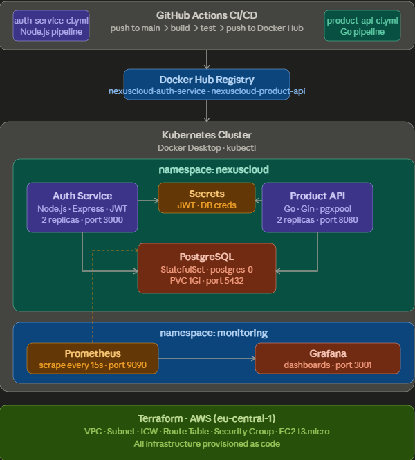
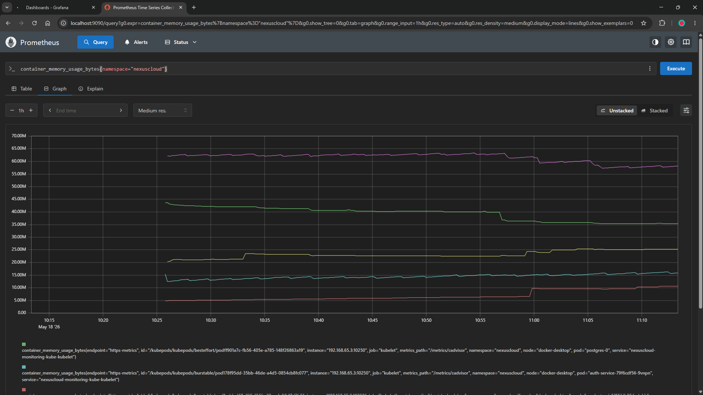

# NexusCloud

> A production-grade cloud-native microservices platform built end-to-end — from infrastructure as code to Kubernetes orchestration, CI/CD automation, and live observability.



---

## What Is This?

NexusCloud is a fully operational backend platform built to demonstrate real-world DevOps and software engineering practices. It is not a tutorial project — every component is designed, deployed, and monitored the way it would be in a professional engineering team.

The platform consists of two microservices deployed to Kubernetes, with automated CI/CD pipelines, infrastructure provisioned entirely through Terraform, and a live Prometheus + Grafana observability stack.

---

## Architecture

```
                        ┌─────────────────────────────────────┐
                        │         Kubernetes Cluster          │
                        │           (Docker Desktop)          │
                        │                                     │
                        │   Namespace: nexuscloud             │
                        │                                     │
                        │  ┌─────────────┐ ┌───────────────┐  │
         HTTP           │  │ auth-service│ │ product-api   │  │
    ─────────────────►  │  │ Node.js/JWT │ │ Go + Gin      │  │
                        │  │ 2 replicas  │ │ 2 replicas    │  │
                        │  └──────┬──────┘ └───────┬───────┘  │
                        │         │                │          │
                        │         └────────┬───────┘          │
                        │                  │                  │
                        │         ┌────────▼────────┐         │
                        │         │   PostgreSQL    │         │
                        │         │   StatefulSet   │         │
                        │         │   PVC: 1Gi      │         │
                        │         └─────────────────┘         │
                        │                                     │
                        │   Namespace: monitoring             │
                        │  ┌────────────┐ ┌────────────────┐  │
                        │  │ Prometheus │ │    Grafana     │  │
                        │  │ scrape/15s │ │  dashboards    │  │
                        │  └────────────┘ └────────────────┘  │
                        └─────────────────────────────────────┘

                        ┌─────────────────────────────────────┐
                        │            AWS (Terraform)          │
                        │  VPC → Subnet → IGW → Route Table   │
                        │  Security Group → EC2 (t3.micro)    │
                        │  Key Pair (SSH)                     │
                        └─────────────────────────────────────┘

                        ┌─────────────────────────────────────┐
                        │          GitHub Actions CI/CD       │
                        │                                     │
                        │  push to main                       │
                        │    → build Docker image             │
                        │    → run integration tests          │
                        │    → push to Docker Hub             │
                        │    (auth-service + product-api)     │
                        └─────────────────────────────────────┘
```

---

## Tech Stack

| Layer | Technology |
|---|---|
| **Auth Service** | Node.js, Express, JWT, bcrypt |
| **Product API** | Go, Gin, pgx |
| **Database** | PostgreSQL 15 (Kubernetes StatefulSet) |
| **Containerisation** | Docker (multi-stage builds) |
| **Orchestration** | Kubernetes (Deployments, Services, StatefulSet, Secrets) |
| **Infrastructure** | Terraform (AWS VPC, EC2, Security Groups, Key Pairs) |
| **CI/CD** | GitHub Actions (build → test → push to Docker Hub) |
| **Monitoring** | Prometheus + Grafana (kube-prometheus-stack via Helm) |
| **Local Dev** | Docker Compose |
| **Registry** | Docker Hub |
| **Cloud** | AWS (eu-central-1, Frankfurt) |

---

## Services

### Auth Service — `services/auth-service`

A JWT-based authentication service built with Node.js and Express.

| Endpoint | Method | Description |
|---|---|---|
| `/health` | GET | Health check — used by Kubernetes liveness and readiness probes |
| `/register` | POST | Register a new user (bcrypt password hashing, cost factor 10) |
| `/login` | POST | Authenticate and receive a signed JWT (24h expiry) |
| `/verify` | GET | Validate a Bearer token — called by other services for auth |

**Security:** Passwords are hashed with bcrypt (cost factor 10). JWTs are signed with HS256. Containers run as non-root (`appuser`). Multi-stage Docker build — final image ~180MB.

### Product API — `services/product-api`

A RESTful product management API built with Go and Gin, backed by PostgreSQL.

| Endpoint | Method | Description |
|---|---|---|
| `/health` | GET | Health check |
| `/api/v1/products` | GET | List all products |
| `/api/v1/products/:id` | GET | Get a single product by ID |
| `/api/v1/products` | POST | Create a product (validated with struct tags) |
| `/api/v1/products/:id` | DELETE | Delete a product |

**Performance:** Uses `pgxpool` connection pooling. Parameterised SQL queries (SQL injection safe). Multi-stage Docker build with static Go binary — final image ~25MB. `RETURNING` clause eliminates redundant SELECT queries after INSERT.

---

## Infrastructure (Terraform)

All AWS infrastructure is defined as code in `infra/terraform/`. Provisions:

- **VPC** with DNS support enabled
- **Public subnet** in `eu-central-1a`
- **Internet Gateway** + route table for public access
- **Security Group** — SSH (22) and application traffic (3000/8080)
- **EC2 instance** (`t3.micro`, free tier) with Amazon Linux 2
- **SSH Key Pair** — public key managed by Terraform

```bash
cd infra/terraform
terraform init
terraform plan
terraform apply
```

Destroy when done (avoids charges):
```bash
terraform destroy
```

---

## Kubernetes Deployment

All manifests are in `infra/kubernetes/base/`. The platform runs across two namespaces:

```bash
# Deploy everything
kubectl apply -f infra/kubernetes/base/namespace.yaml
kubectl apply -f infra/kubernetes/base/secrets.yaml
kubectl apply -f infra/kubernetes/base/postgres.yaml
kubectl apply -f infra/kubernetes/base/auth-service.yaml
kubectl apply -f infra/kubernetes/base/product-api.yaml

# Verify
kubectl get all -n nexuscloud
```

Expected output:
```
NAME                               READY   STATUS    RESTARTS   AGE
pod/auth-service-xxx               1/1     Running   0          2m
pod/auth-service-yyy               1/1     Running   0          2m
pod/postgres-0                     1/1     Running   0          2m
pod/product-api-xxx                1/1     Running   0          2m
pod/product-api-yyy                1/1     Running   0          2m

NAME                   TYPE        CLUSTER-IP   PORT(S)
service/auth-service   ClusterIP   10.x.x.x     3000/TCP
service/postgres       ClusterIP   None         5432/TCP
service/product-api    ClusterIP   10.x.x.x     8080/TCP

NAME                           READY   UP-TO-DATE   AVAILABLE
deployment.apps/auth-service   2/2     2            2
deployment.apps/product-api    2/2     2            2

NAME                        READY
statefulset.apps/postgres   1/1
```

**Self-healing demo:**
```bash
kubectl delete pod -n nexuscloud -l app=auth-service
kubectl get pods -n nexuscloud -w
# Watch Kubernetes immediately recreate both pods
```

---

## CI/CD Pipelines

Two independent GitHub Actions pipelines — one per service.

**Trigger:** Push to `main` affecting files in the service directory.

**Pipeline stages:**
1. Checkout code
2. Set up language runtime (Node.js / Go)
3. Login to Docker Hub
4. Build Docker image
5. Start container + run integration tests against all endpoints
6. Push to Docker Hub with two tags: `latest` and `sha-<commit>`

**Integration tests:** Each pipeline starts a real PostgreSQL service container and tests actual HTTP endpoints — not mocks.

Secrets stored in GitHub Actions encrypted secret store. Never committed to code.

---

## Observability

Deployed with Helm (`kube-prometheus-stack`):

```bash
helm repo add prometheus-community https://prometheus-community.github.io/helm-charts
helm install nexuscloud-monitoring prometheus-community/kube-prometheus-stack \
  --namespace monitoring \
  --values infra/monitoring/prometheus-values.yaml
```

**Access Prometheus:**
```bash
kubectl port-forward -n monitoring svc/prometheus-operated 9090:9090
# Open http://localhost:9090
```

**Sample PromQL queries:**
```promql
# Memory usage per pod in the nexuscloud namespace
container_memory_usage_bytes{namespace="nexuscloud"}

# CPU usage rate
rate(container_cpu_usage_seconds_total{namespace="nexuscloud"}[5m])
```

**Access Grafana:**
```bash
kubectl port-forward -n monitoring svc/nexuscloud-monitoring-grafana 3001:80
# Open http://localhost:3001
# Username: admin / Password: nexuscloud-grafana
```



---

## Local Development

Run the full stack locally with Docker Compose:

```bash
docker compose up --build
```

Services available at:
- Auth Service: `http://localhost:3000`
- Product API: `http://localhost:8080`
- PostgreSQL: `localhost:5432`

**Test the auth flow:**
```bash
# Login
curl -X POST http://localhost:3000/login \
  -H "Content-Type: application/json" \
  -d '{"username":"admin","password":"password"}'

# Verify token
curl http://localhost:3000/verify \
  -H "Authorization: Bearer <token>"

# Create a product
curl -X POST http://localhost:8080/api/v1/products \
  -H "Content-Type: application/json" \
  -d '{"name":"NexusCloud Hoodie","price":49.99,"stock":50}'

# List products
curl http://localhost:8080/api/v1/products
```

---

## Repository Structure

```
nexuscloud/
├── services/
│   ├── auth-service/           # Node.js JWT authentication
│   │   ├── src/index.js
│   │   ├── Dockerfile
│   │   └── package.json
│   └── product-api/            # Go REST API
│       ├── cmd/main.go
│       ├── internal/
│       │   ├── handlers/       # HTTP handlers
│       │   ├── db/             # PostgreSQL connection pool
│       │   └── models/         # Data structures
│       └── Dockerfile
├── infra/
│   ├── terraform/              # AWS infrastructure as code
│   ├── kubernetes/
│   │   └── base/               # k8s manifests
│   └── monitoring/             # Prometheus + Grafana config
├── .github/
│   └── workflows/
│       ├── auth-service-ci.yml
│       └── product-api-ci.yml
└── docker-compose.yml
```

---

## Key Engineering Decisions

**Why Go for the Product API?** Go compiles to a static binary — the final Docker image is ~25MB vs ~180MB for Node.js. Under load, Go handles concurrency with goroutines rather than an event loop, making it more predictable for database-heavy workloads.

**Why StatefulSet for PostgreSQL?** Unlike Deployments, StatefulSets give each pod a stable network identity and its own PersistentVolumeClaim. This means `postgres-0` always gets the same storage — critical for databases where data must survive pod restarts.

**Why separate CI pipelines per service?** Path-based triggers (`paths:` filter) mean a change to the Product API only rebuilds and tests the Product API. In a monorepo with many services, this prevents unnecessary builds and keeps pipelines fast.

**Why parameterised SQL queries?** All database queries use `$1, $2` placeholders — pgx sends query and parameters separately to PostgreSQL, making SQL injection structurally impossible regardless of user input.

---

## Author

**Mohamed Nidhal Sanaa**
MSc Computer Science + Telecommunications Engineering — Passau, Germany

[](https://github.com/sanaanidhal)
[](https://linkedin.com/in/sanaa-nidhal)
[](https://hub.docker.com/u/sanaanidhal)
